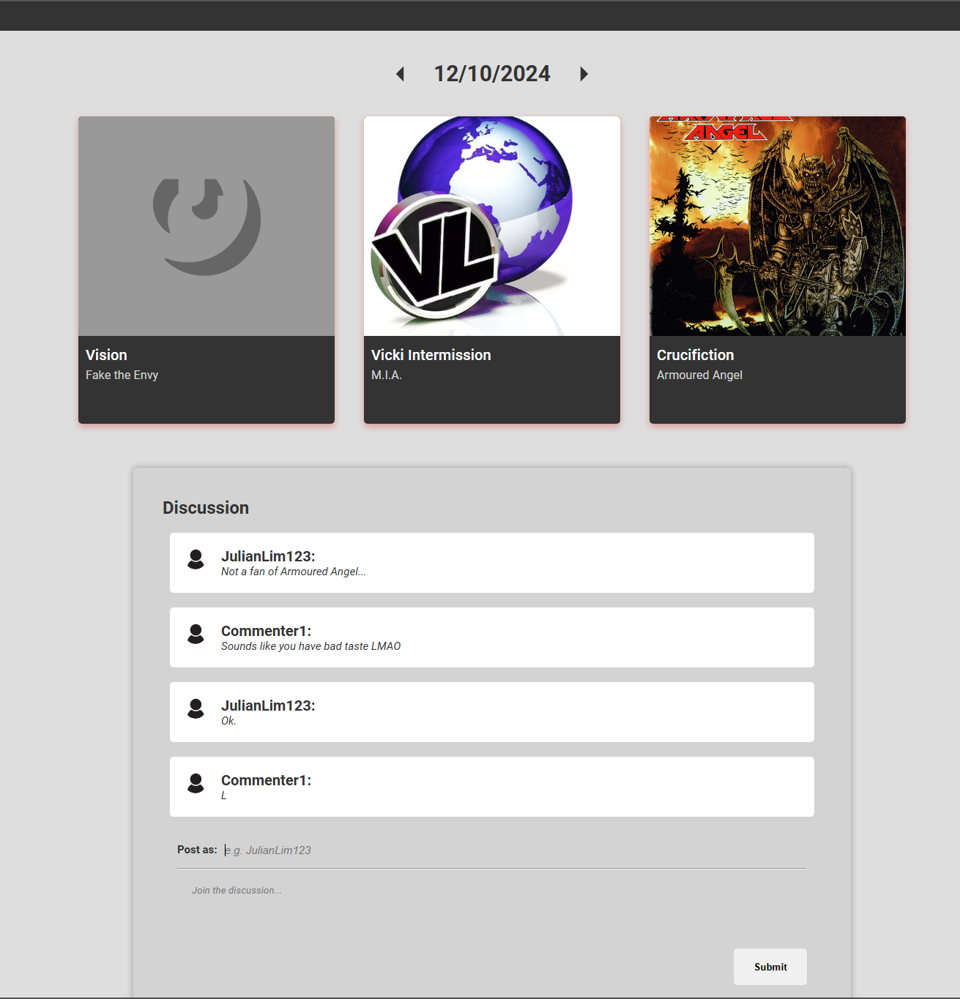

  

<h3 align="center">Random Songs Daily Discussion Board</h3>

---

## 🧐 About 

A web app where users discuss 3 randomly selected songs queried from the GeniusAPI, updated daily. Checkout a live demo here: [Link](https://benevolent-bonbon-e0ef4f.netlify.app/)

## ⛏️ Built Using 

- [MongoDB](https://www.mongodb.com/) 
- [Express](https://expressjs.com/)
- [NodeJs](https://nodejs.org/en/)
- [ReactJs](https://react.dev/)

## ✍️ Authors 

- [@julianl05](https://github.com/julianl05)

