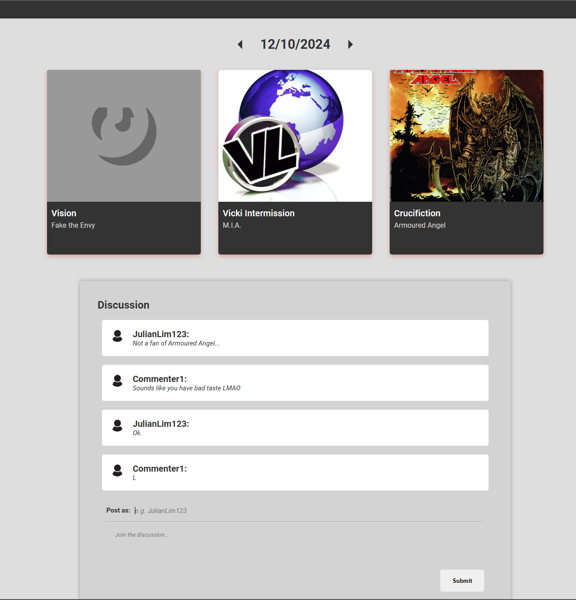

  

<h3 align="center">Random Songs Daily Discussion Board</h3>

---

## 🧐 About 

A web app where users discuss 3 randomly selected songs queried from the GeniusAPI, updated daily. 

## 🏁 Getting Started 

### Prerequisites

### Installing

## 🎈 Usage 

## 🚀 Deployment 

## ⛏️ Built Using 

- [MongoDB](https://www.mongodb.com/) 
- [Express](https://expressjs.com/)
- [NodeJs](https://nodejs.org/en/)
- [ReactJs]

## ✍️ Authors 

- [@julianl05](https://github.com/julianl05)

